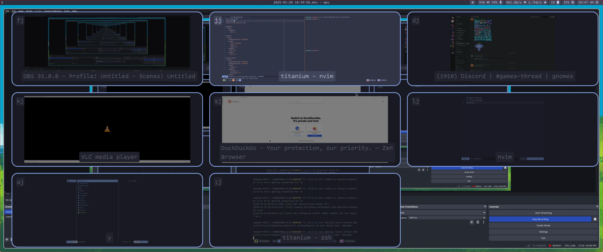

# peekaboo

A small, configurable window switcher for Hyprland.

## Demo



https://github.com/user-attachments/assets/91acb2cd-6866-4a8a-bf4d-aca3b2855538

## Install

### Building

#### Arch

```sh
yay -Sy meson wayland-protocols wayland cairo pango libxkbcommon libcjson libcyaml

meson build && meson install -C build
```

## Configuration

An example configuration file with the settings shown in the demo is in [config.example.yml](./config.example.yml).
The configuration is loaded from `$XDG_CONFIG_HOME/peekaboo/config.yml` or `$HOME/.config/peekaboo/config.yml`
by default, but may be overridden with the `--config` flag.

## Credits

I learned much of how to write a Wayland client from reading [Tofi](https://github.com/philj56/tofi/tree/master)
and [wl-kbptr](https://github.com/moverest/wl-kbptr/tree/main) and much of this project structure is inspired from
their code.
